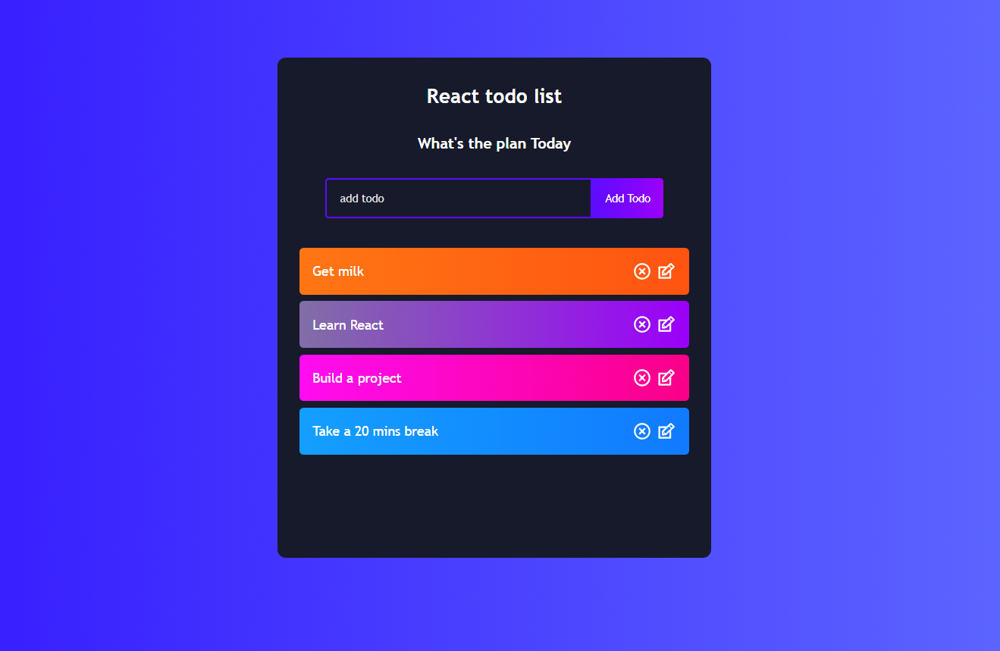

# React-todo-list
## Live Code - [Preview](https://next-crypto-tracker.vercel.app)
<!-- ctrl+shift+v : preview -->


---

### Table of Contents
You're sections headers will be used to reference location of destination.

- [Description](#description)
- [How To Use](#how-to-use)
- [Author Info](#author-info)

---

## Live Code - [Preview](https://next-crypto-tracker.vercel.app)

## Description
- It was a great way to practise how to pass props from one component to another and update the value depending on the user input.
- The user can be able to: 
   - Add a todo 
   - Edit the todo added
   - Remove the todo
   - Make the todo as complete


#### Technologies
- Html
- Css
- React


[Back To The Top](React-todo-list)

---
#### Installation
```bash
    Use a command Prompt and type : npm install
    # or
    npm i
```

## How To Use
First, run the development server:

```bash
npm run start
# or
yarn start
```

Open [http://localhost:3000](http://localhost:3000) with your browser to see the result.


 
## Author Info
#### [Jane Muchiri ](https://github.com/muchirijane)

- Twitter - [@TracyCss](https://twitter.com/TracyCss)
- Website - [portfolio](https://jane.vercel.app/)

[Back To The Top](React-todo-list)

